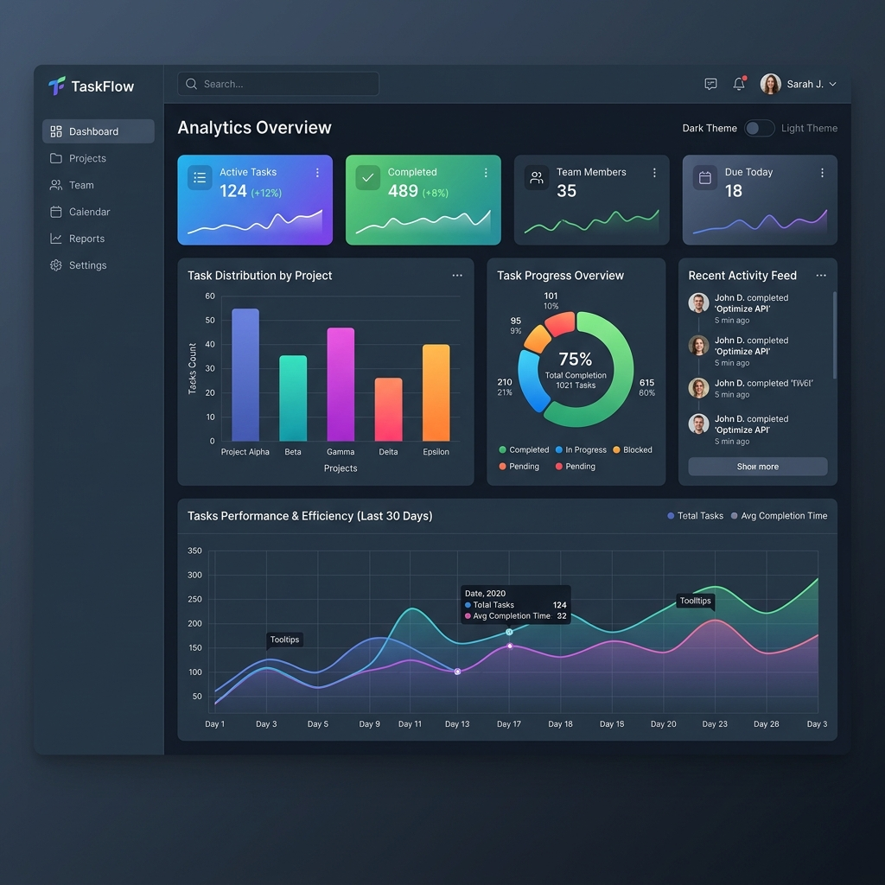
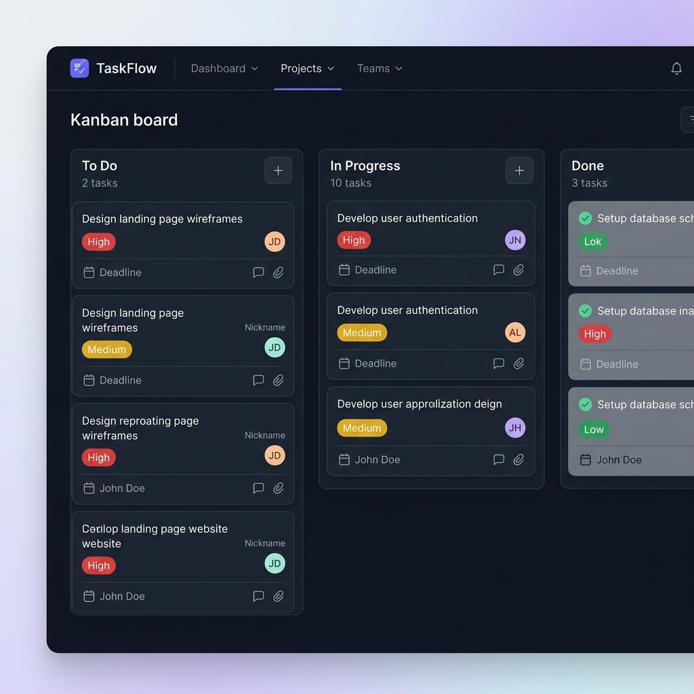
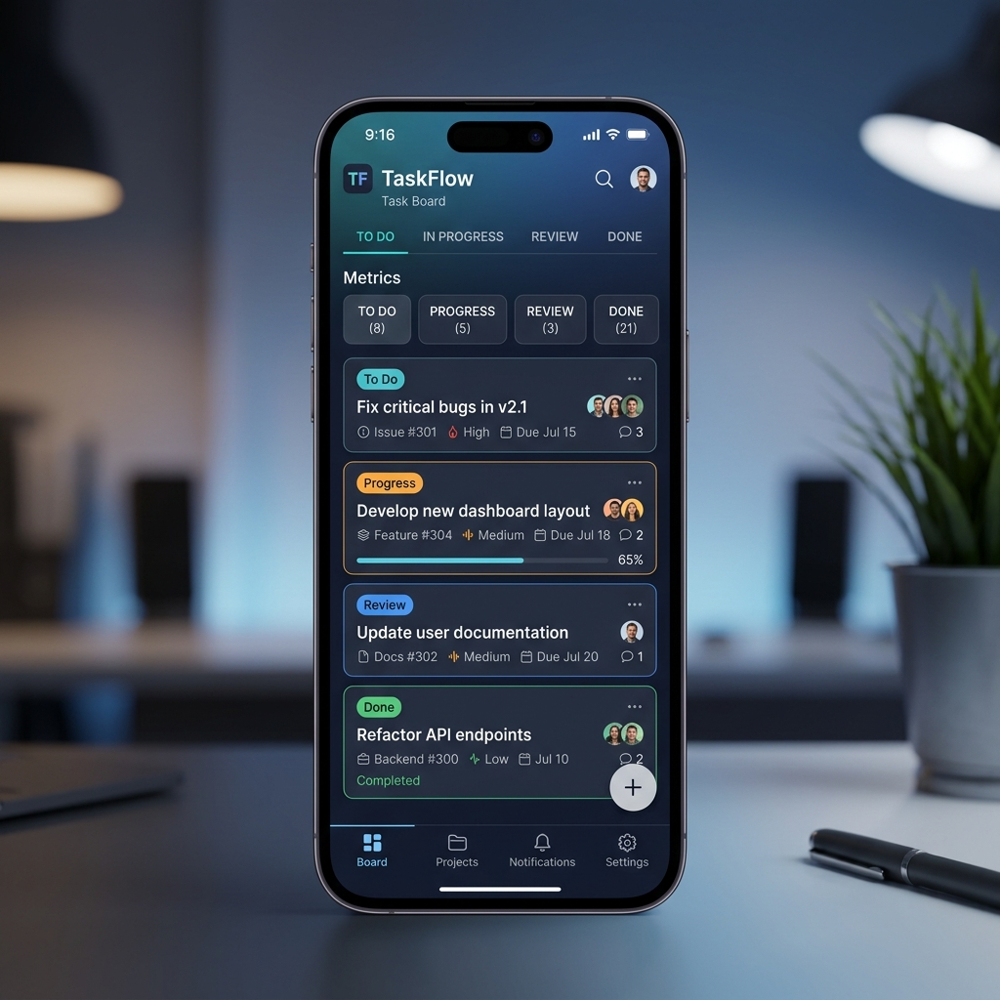

# TaskFlow ⚡

TaskFlow is a premium, modern web-based project management and collaborative task tracking application. Designed with high-performance metrics, responsive interfaces, and advanced glassmorphism aesthetics, it enables users and teams to manage workflows, view key insights, and boost productivity effortlessly.

---

## 📸 Key Page Mockups

Here is a visual overview of TaskFlow's core interfaces:

### 1. Symmetrical Login Page
A clean, secure user authentication interface with a modern card layout and smooth entry transitions.


### 2. Analytical Dashboard
Real-time productivity insights featuring stacked daily bar charts, workflow state donut charts, and actual vs. predictive effort line charts.


### 3. Kanban Board View
An interactive task management canvas split into columns (To Do, In Progress, Done) supporting fluid drag-and-drop actions.


### 4. Symmetrical Mobile Viewport
A fully responsive grid layout showing cards, navigation, and metrics optimized for mobile screens.


---

## 🛠️ Tech Stack & Core Libraries

TaskFlow is built on the robust MERN stack using state-of-the-art styling and AI assistance libraries:

### Frontend
* **Core**: React (v19) & Vite (v8)
* **Styling**: Tailwind CSS (v4) & Vanilla CSS overrides (for glowing states and dark theme variables)
* **Icons**: React Icons (Fi / Feather icons library)
* **Notifications**: React Hot Toast
* **HTTP Client**: Axios

### Backend
* **Runtime & Framework**: Node.js & Express.js
* **Authentication**: JSON Web Token (JWT) & bcryptjs (password hashing)
* **SDKs**: `@google/genai` (Official Google Gemini AI SDK)

### Database
* **Database**: MongoDB Atlas (Cloud database)
* **Mongoose ODM**: Object Data Modeling library for Node.js schema validation

---

## 🚀 Local Setup & Run Instructions

Follow these step-by-step instructions to clone, set up, and run both frontend and backend servers on your local machine:

### Prerequisites
* [Node.js](https://nodejs.org/) (v18.x or above recommended)
* [MongoDB](https://www.mongodb.com/try/download/community) installed locally or a MongoDB Atlas URI

---

### Step 1: Backend Setup

1. Navigate to the backend directory:
   ```bash
   cd Backend
   ```
2. Install dependencies:
   ```bash
   npm install
   ```
3. Create a `.env` file from the example:
   ```bash
   cp .env.example .env
   ```
4. Open the `.env` file and populate it with your database connection URI, JWT secrets, Gemini API key, and Cloudinary credentials. (See [Environment Variable Setup](#env-variable-setup) below).
5. Start the backend development server (runs on `http://localhost:5000` by default):
   ```bash
   npm run dev
   ```

---

### Step 2: Frontend Setup

1. Open a new terminal and navigate to the frontend directory:
   ```bash
   cd frontend
   ```
2. Install dependencies:
   ```bash
   npm install
   ```
3. Start the Vite development server (runs on `http://localhost:5173` by default):
   ```bash
   npm run dev
   ```
4. Access the web app in your browser at: `http://localhost:5173`

---

<a name="env-variable-setup"></a>
## 🔑 Environment Variable Setup

The backend configuration is managed using a `.env` file. A sample structure is provided in **`Backend/.env.example`**:

```env
# Server Configuration
PORT=5000

# Database Configuration
MONGO_URI=mongodb+srv://<username>:<password>@cluster.mongodb.net/taskflow?retryWrites=true&w=majority

# JWT Authentication Secret
JWT_SECRET=your_super_secret_jwt_string_here

# AI / Gemini API Integration
GEMINI_API_KEY=AIzaSy...your_gemini_api_key_from_google_ai_studio

# Cloudinary Integration (for avatar images)
CLOUDINARY_CLOUD_NAME=your_cloudinary_cloud_name
CLOUDINARY_API_KEY=your_cloudinary_api_key
CLOUDINARY_API_SECRET=your_cloudinary_api_secret
```

---

## 🤖 AI Smart Suggestion Feature

### The Chosen LLM API
We chose the **Google Gemini API** (specifically the **`gemini-2.5-flash`** model) using the official **`@google/genai`** SDK for the following reasons:
1. **Low Latency & High Speed**: `gemini-2.5-flash` is extremely lightweight and fast, delivering recommendations in milliseconds.
2. **Structured JSON Output**: The model has high instruction-following accuracy, allowing us to enforce structured JSON responses consistently.
3. **Multilingual Understanding**: It easily reads inputs in any language (including Hindi, Hinglish, Spanish, French, etc.) and seamlessly translates and processes them to generate output in standardized English.
4. **Developer-friendly pricing**: Free and accessible tiers via Google AI Studio makes it an ideal choice for project integrations.

### How the AI Feature Works
1. **Task Detail Entry**: The user opens the "New Task" form, types a description in their language of choice (e.g., *"mujhe monday tak authentication api banani hai low priority pe"*), and clicks the **AI Suggest** button.
2. **Backend Payload**: The client sends the description text along with the current date/time in ISO format to the backend route `/api/ai/suggest`.
3. **Structured Prompting**: The backend creates a specific system instruction telling the AI to act as a project manager, parse the description, and output recommendations for:
   * **title**: A concise, professional title.
   * **priority**: Mapped to `Low`, `Medium`, or `High`.
   * **estimate**: Hours/days required (e.g., `8 hrs` or `2 days`).
   * **dueDate**: An ISO date-time string calculated relative to the user's current date/time.
4. **Strict JSON Parsing**: The prompt enforces a strict JSON template return structure. Once received, the backend strips any markdown wrapping and parses the text into a clean JSON object.
5. **Autofill Frontend UI**: The frontend receives the response and automatically populates the form fields (Title, Priority, Estimate, Due Date) in real-time, allowing the user to simply review and submit the task.
